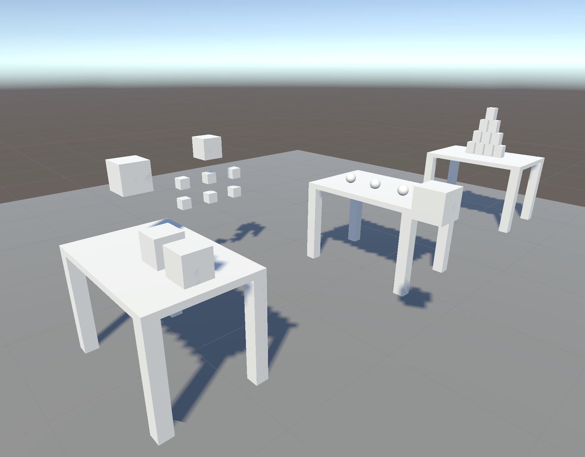
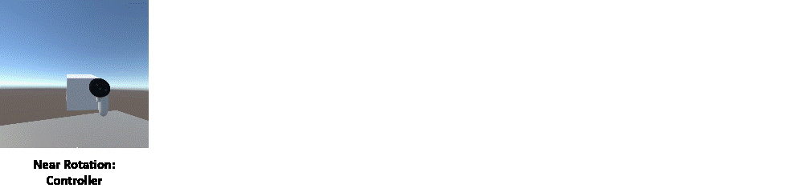
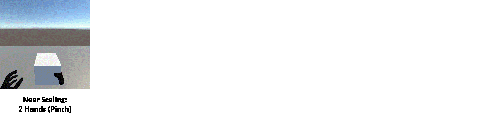
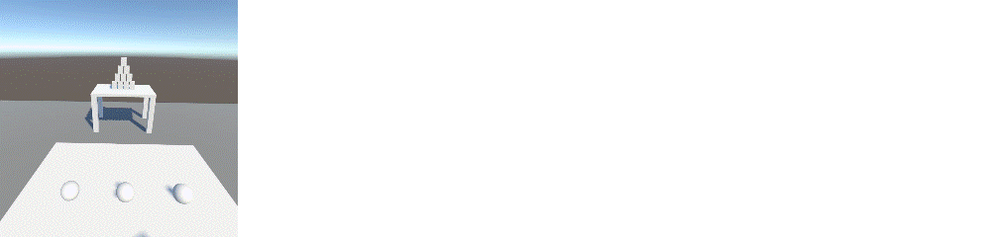

# Interaction in Mixed Reality: Basic Concepts

## Assignment 2: 3D Object Manipulation (Group Work)

**Deadline: 21.11.2023 15:15**  

### Goals

In this assignment, you will learn how to implement the four basic 3D manipulation tasks (selection, positioning, rotation, and scaling) using different interaction techniques. Therefore, you will develop an interaction showroom where the manipulation tasks can be performed on different objects with different parameters using different input devices (controller and hands). The parameters of the objects and the input device are taken into account when choosing the interaction technique.

### Tasks

- [ ] [Add Unity Project to the group Git Repository](#add-unity-project-to-the-group-git-repository) (5 Points)
- [ ] [Implement different selection techniques](#implement-different-selection-techniques)
  - [ ] [Selection of near objects with the controller](#selection-of-near-objects-with-the-controller) (5 Points)
  - [ ] [Selection of far objects with the controller](#selection-of-far-objects-with-the-controller) (5 Points)
  - [ ] [Selection of near objects with the hand (pinching)](#selection-of-near-objects-with-the-hand-pinching) (5 Points)
  - [ ] [Multi-selection of near objects by touching with the controller or hand](#multi-selection-of-near-objects-by-touching-with-the-controller-or-hand) (5 Points)
- [ ] [Implement different positioning techniques](#implement-different-positioning-techniques)
  - [ ] [Positioning of near objects with the controller](#positioning-of-near-objects-with-the-controller) (5 Points)
  - [ ] [Positioning of near objects with the hand (pinching)](#positioning-of-near-objects-with-the-hand-pinching) (5 Points)
  - [ ] [Positioning of near objects with gravity](#positioning-of-near-objects-with-gravity) (5 Points)
  - [ ] [Positioning of far objects with the controller](#positioning-of-far-objects-with-the-controller) (10 Points)
  - [ ] [Positioning of objects with constraints](#positioning-of-objects-with-constraints) (10 Points)
- [ ] [Implement different rotation techniques](#implement-different-rotation-techniques)
  - [ ] [Rotation of near objects with the controller](#rotation-of-near-objects-with-the-controller) (10 Points)
  - [ ] [(Bonus) Rotation of far objects with the controller](#bonus-rotation-of-far-objects-with-the-controller) (10 Points)
  - [ ] [(Bonus) Rotation of objects with constraints](#bonus-rotation-of-objects-with-constraints) (10 Points)
- [ ] [Implement scaling of (near) objects with two hands](#implement-scaling-of-near-objects-with-two-hands) (10 Points)
- [ ] [Implement can knockdown game (manipulation with physics)](#implement-can-knockdown-game-manipulation-with-physics) (15 Points)
- [ ] [Keep the project clean](#keep-the-project-clean) (5 Points)

### Instructions

#### Add Unity Project to the group Git Repository

- Clone this Git repository on both of your computers.
- Choose one of your individual projects from Assignment 1 to continue with group work.
- Copy the contents of the individual Unity project from assignment 1 to the group Git repository folder.
- Create a new scene for this assignment.
- Add, commit, and push the changes.

#### Implement different selection techniques

> ⚠️ In the entire assignment, you are allowed to support only one controller/hand (right or left), except for scaling.

##### Selection of near objects with the controller

- Add a floor to the (new) scene
- Create an object of your choice.
- Make the object selectable (and deselectable) by moving a controller into the object and pressing the trigger.
  > 💡 The trigger was pressed when the trigger value was `0` in the last frame and the trigger value is `>0` in this frame. 
- Provide visual feedback when the object is selected (or deselected)
  > 💡 For visual feedback, you can change the color of the object, or make other visual changes (e.g. change the outline).
- Provide visual feedback when the user could select the object (when the controller touches the object). It should be possible for the user to distinguish between deselected, selectable (hover), and selected.

##### Selection of far objects with the controller

- Make the object selectable from a distance by pointing the controller at the object and pressing the trigger.
- Use a ray to provide visual feedback when the user could manipulate the object from a distance. The ray should only be visible when pointing at the object.
  > 💡 You can use a `LineRenderer` for the visual ray. 
- Provide the same visual feedback as in the previous task.

##### Selection of near objects with the hand (pinching)

- Make the object selectable (and deselectable) by moving a hand into the object and making a pinch gesture.
  > 💡 You can find information on how to use hand tracking in the official Meta documentation: [Set Up Hand Tracking](https://developer.oculus.com/documentation/unity/unity-handtracking/)
- Provide the same visual feedback as in the previous task.

##### Multi-selection of near objects by touching with the controller or hand

- Create six additional objects to the scene.
- Make the objects selectable (and deselectable) by moving the hand or controller into an object.
- Provide visual feedback when an object is selected (or deselected).
  > 💡 Because objects are selected by touch, you do not need to provide visual feedback for potential manipulation (hover) in this task. However, it would be possible, for example, when the hand or controller is close to the object.

  > 💡 Normally, we would give the user the option to switch between single selection and multi selection mode. In this assignment, however, the objects determine the mode.

#### Implement different positioning techniques

##### Positioning of near objects with the controller

- Create an object of your choice.
- Make the position of the object changeable by moving a controller into the object and pressing (and holding) the trigger. When the trigger is released, the manipulation of the position should stop. In the process, you are also allowed to manipulate the rotation of the object.
  > 💡 You can use `Transform.SetParent()`

  > 💡 The trigger was released when the trigger value was `>0` in the last frame and the trigger value is `0` in this frame. 
- Provide visual feedback when the position of the object is currently changed (manipulation) and when the user could change the position of the object (hover) (when the controller touches the object). The actions should be distinguishable.

##### Positioning of near objects with the hand (pinching)

- Make the position of the object changeable by moving a hand into the object and making a pinch gesture. When the pinch gesture is released, the positioning should stop. In the process, you are also allowed to manipulate the rotation of the object.
- Provide the same visual feedback as in the previous task.

##### Positioning of near objects with gravity

- Build a table from Unity's primitive objects (or add a table 3D object).
- Create an object above the table.
- Set up the object so that it uses gravity (falls on the table).
- Make the position of the object changeable by controller and hand as in the previous tasks.
- The gravity should only be applied when the object is currently not manipulated.
  > 💡 You can make the object kinematic while manipulating
- Provide the same visual feedback as in the previous task.

##### Positioning of far objects with the controller

- Make the position of the objects changeable from a distance by pointing the controller at an object and pressing (and holding) the trigger. When the trigger is released, the manipulation of the position should stop.
- When positioning, the object should always rotate towards the controller (forward vector looking at the controller).
- The distance between the controller and the object is fixed. It should be adjustable by moving the thumb stick up (object moves away from the controller) or down (object approaches the controller). The object should stop before it is inside the controller.
- Use a ray to provide visual feedback when the user could manipulate the object from a distance. The ray should only be visible when pointing at the object.
- In addition, provide the same visual feedback as in the previous task.

##### Positioning of objects with constraints

- Build a table from Unity's primitive objects (or add a table 3D object).
- Create an object on top of the table.
- Make the position of the object on the table changeable. The object is not allowed to leave the table (neither vertically nor horizontally). The object can therefore only be moved on the table. You are free to choose only one of the previous positioning techniques (controller, hand, ray) or support all of them.
- When positioning, the rotation of the object should not be changeable.
- Provide the same visual feedback as in the previous task.

#### Implement different rotation techniques

##### Rotation of near objects with the controller

- Make the rotation of objects (from the positioning task) changable by moving a controller into an object and pressing (and holding) the hand trigger (the trigger at the side of the controller). When the trigger is released, the manipulation of the rotation should stop. This action should only change the rotation, not the position of the object.
  > 💡 The hand trigger is located on the side of the controller. See also [Map Controllers](https://developer.oculus.com/documentation/unity/unity-ovrinput/#touch-input-mapping)

  > 💡 To calculate difference C between quaternions A and B: `C = A * Quaternion.Inverse(B)`.

  > 💡 To add the difference C to D: `D = C * D`.
  
  > ⚠️ Quaternion multiplication is not commutative (A * B != B * A). It is important which quaternion is on the left and which is on the right side of the multiplication.

- Provide visual feedback when the rotation of an object is currently changed and when the user could change the rotation of an object (when the controller touches the object). The actions should be distinguishable.
  > 💡 You could provide the same visual feedback as when the user could change the position of an object.

##### (Bonus) Rotation of far objects with the controller

- Make the rotation of objects changeable from a distance by pointing the controller at an object and pressing (and holding) the hand trigger. When the trigger is released, the manipulation of the rotation should stop.
- Change the X rotation of the object by moving the controller up (+) and down (-).
- Change the Y rotation of the object by moving the controller left (+) and right (-).
- Change the Z rotation of the object by rotating the controller around the Z axis.
- Provide the same visual feedback as in the previous task.

##### (Bonus) Rotation of objects with constraints

- Create a turntable by mounting a (flat) cylinder on top of a (flat) cube.
- Create another cube and put it on top of the turntable (a 3D model of a cat is also allowed)
- Make the turntable (cylinder) rotatable around the Y axis (only) by moving a controller into it and pressing (and holding) the trigger. You are also allowed to implement it with the hand instead of the controller. The turntable should be pushable. This means that it should not immediately lose its velocity when the manipulation is stopped (trigger is released).
- Provide visual feedback when the user could change the turntable rotation (controller (or hand) touches the turntable)
- The object on top of the turntable should rotate with the turntable.
  > 🎶 "You spin me right 'round, baby, right 'round ..."

#### Implement scaling of (near) objects with two hands

- Create an object of your choice.
- Make the object scalable by moving both hands into the object, making pinch gestures with both hands, and moving the hands together (shrink) or apart (enlarge).
  > 💡 `OVRHand.PointerPose` returns the transform of the pinch position of the OVRHand.
- Provide visual feedback when the scaling of an object is currently changed and when the user could change the scaling of an object (when both hands inside the object). The actions should be distinguishable.

#### Implement can knockdown game (manipulation with physics)

- Create a table with 10 cans (e.g., cubes) stacked as a pyramid.
  > ⚠️ Cylinders use a `CapsuleCollider` and fall over. If you want to use cylinders you have to replace the collider. 
- Create another table in front of the can table with several balls on it. You can create a border around the table so that the balls don't roll off.
- Make the balls throwable by moving a controller inside a ball, pressing and holding the trigger, and releasing the trigger at the end of the throwing swing.
  > 💡 You can use the same manipulation method as in the [Positioning of near objects with gravity](#positioning-of-near-objects-with-gravity) task.

  > 💡 After setting `Rigidbody.isKinematic = false` you must add a force in the throwing direction. For this you can save the last e.g. 10 positions, calculate the direction, and multiply the direction with a constant. For example: `Rigidbody.AddForce(direction * 1000f)`. 
- The cans should be able to be knocked down by the balls.
- Provide the same visual feedback as in the positioning tasks.

#### Keep the project clean

- Keep the Hierarchy structured. Structure objects that belong together in a parent GameObject. Exception are libraries that require a certain structure.
- Give each GameObject and Prefab a meaningful name. "GameObject (1)" and "Cube" is meaningless. This is especially a problem during debugging when you instantiate objects and don't know which object is what.
- Keep the folder structure clean. For example, you should create folders for Materials, Prefabs, Scripts, and so on. But also a folder structure that groups by feature is fine. There should be no scripts or assets directly in the Assets folder.