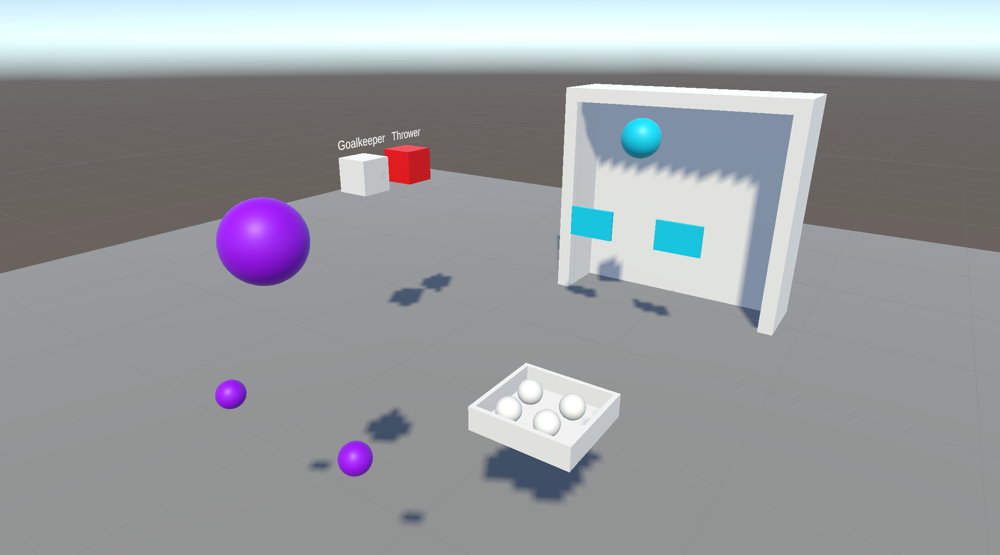

# Interaction in Mixed Reality: Basic Concepts

## Assignment 3: Networking (Group Work)

**Deadline: 05.12.2023 15:15**  

### Goals

In this assignment you will learn how to implement a multiplayer Mixed Reality application using a networking library in Unity. Therefore, you will develop a small game in which one player tries to throw balls into a goal (using a controller), while the other player tries to block the balls with the hands. Both players are represented by a visual user representation that represents the player's position and capabilities (in a simple form).

### Tasks

- [ ] [Create a new scene and add networking (e.g., Colibri) to the project](#create-a-new-scene-and-add-networking-eg-colibri-to-the-project) (5 Points)
- [ ] [Create user representations and synchronize their position and rotation between clients](#create-user-representations-and-synchronize-their-position-and-rotation-between-clients) (25 Points)
- [ ] [Create the game assets: Goal and ball box (with balls)](#create-the-game-assets-goal-and-ball-box-with-balls) (10 Points)
- [ ] [Make the balls throwable with the controller and defendable with the hands](#make-the-balls-throwable-with-the-controller-and-defendable-with-the-hands) (10 Points)
- [ ] [Synchronize the ball movements (with physics)](#synchronize-the-ball-movements-with-physics) (15 Points)
- [ ] [Redesign both user representations to represent the player's capabilities](#redesign-both-user-representations-to-represent-the-players-capabilities) (30 Points)
- [ ] [Keep the project clean](#keep-the-project-clean) (5 Points)

### Instructions

#### Create a new scene and add networking (e.g., Colibri) to the project

- Create a new scene for this assignment.
- Add a floor to the (new) scene.
- Setup the scene for the Meta Quest (e.g., add `OVRCameraRig`).
- Add Colibri to the project by following the installation instructions on [GitHub](https://github.com/hcigroupkonstanz/Colibri/tree/main/colibri-unity). You can choose to install Colibri using Unity Package Manager (UPM) or Unity Package.
- Setup Colibri by entering the app name and server address in the Colibri Configuration ("Window" -> "Colibri Configuration"). Choose a unique app name (e.g., "mr-group-01") and set the server address to `colibri.hci.uni-konstanz.de`. Press "Save Config" to save you changes.
- Add the `[RemoteLogger]` prefab ("Packages" -> "Colibri" -> "Prefabs") to the scene and press play. If the connection is successful, the message "Connection to web server established" should appear in the console and you should also be able to see the console messages in the [Web Interface](https://colibri.hci.uni-konstanz.de/log/)
  > 💡 You can filter by app name in the top right of the web interface.

> 💡 You are allowed to choose another networking solution.

> ⚠️ Colibri is still in development. If you notice bugs or you have any problems using it, please do not hesitate to contact [Sebastian](mailto:sebastian.hubenschmid@uni-konstanz.de) or [Daniel](mailto:daniel.immanuel.fink@uni-konstanz.de) (E-mail or Mattermost).

#### Create user representations and synchronize their position and rotation between clients

- Create a simple user representation that visualizes the user's head and hands/controllers (e.g., with three spheres).
- Add two user representation to the scene representing the two player roles thrower and goalkeeper.
- Synchronize the position and rotation of both user representation's body parts between clients.
  > 💡 You can add the `SyncTransform` script to synchronize the individual body parts. You should manually set an Id or generate an Id for every individual body part. It is important that the Ids of the body parts differ between the two user representations.

  > ⚠️ Do not forget to add the `[SyncTranformManager]` prefab from Colibri (Packages/Colibri/Prefabs) to the scene.
- Create a selection menu that enables the user to select the player role (thrower or goalkeeper).
- While a player role is selected, update the position and rotation of the corresponding user representation to the position and rotation of the HMD's head and hands/controllers (from the `OVRCameraRig`). n 

> 💡 For this assignment, you do not have to prevent users from choosing the same role.

#### Create the game assets: Goal and ball box (with balls)

- Create a goal (e.g., with cubes)
- Create in front of the goal a ball box (e.g., with cubes)
- Add balls to the ball box (e.g., spheres)

#### Make the balls throwable with the controller and defendable with the hands

- Make the balls in the ball box throwable by moving a controller inside a ball, pressing and holding the trigger, and releasing the trigger at the end of the throwing swing.
  > 💡 This is similar to the knockdown game of Assignment 2
- Make the balls defendable with the hands. The balls do not have to be defendable by the 3d mesh of the hand, but the hands of the goalkeeper's user representation (e.g., flat cubes as hands).

#### Synchronize the ball movements (with physics)

- Synchronize the ball movements.
  > 💡 You can again use the `SyncTransform` script.
- Make sure that only the thrower client controls the physics of the balls.
  > 💡 The `PhysicsAuthority` field of `SyncTransform` defines which client is currently controlling the physics. Only one client can control the physics of an object at a time. If you set `PhysicsAuthority` to `true` on one client, it is automatically set to `false` on all other clients. If you default check the `PhysicsAuthority` field, the first client receives the physics authority.

  > 💡 When starting the manipulation with the ball, the thrower should set `PhysicsAuthority = true` to control the physics.

  > ⚠️ The `isKinematic` field of the `Rigidbody` will be overwritten by the `isKinematic` field of the `SyncTransform`. Therefore, you must always (additionally) set the `isKinematic` field of the `SyncTransform`.

#### Redesign both user representations to represent the player's capabilities

- Redesign the thrower's hand to represent the capability to throw balls. Make sure that the position of a picked up ball is at a suitable position of the hand representation.
- Refine the goalkeeper's hands to represent the capability to defend balls.
  
> 💡 For this tasks you can be creative.

#### Keep the project clean

- Keep the Hierarchy structured. Structure objects that belong together in a parent GameObject. Exception are libraries that require a certain structure.
- Give each GameObject and Prefab a meaningful name. "GameObject (1)" and "Cube" is meaningless. This is especially a problem during debugging when you instantiate objects and don't know which object is what.
- Keep the folder structure clean. For example, you should create folders for Materials, Prefabs, Scripts, and so on. But also a folder structure that groups by feature is fine. There should be no scripts or assets directly in the Assets folder.